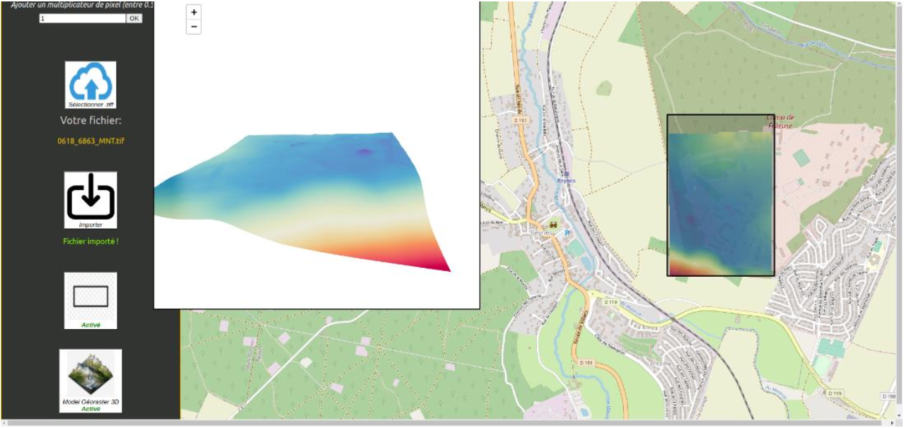
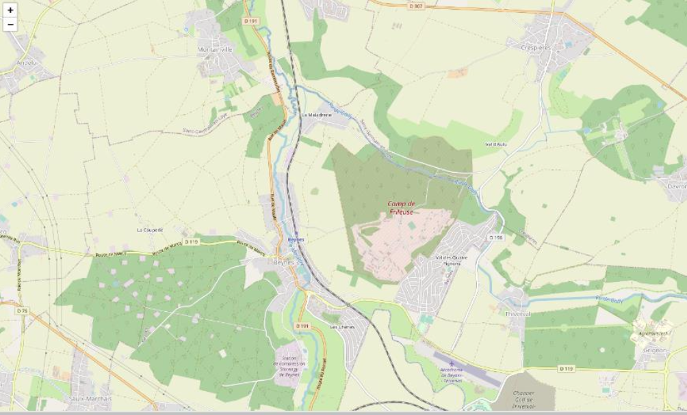
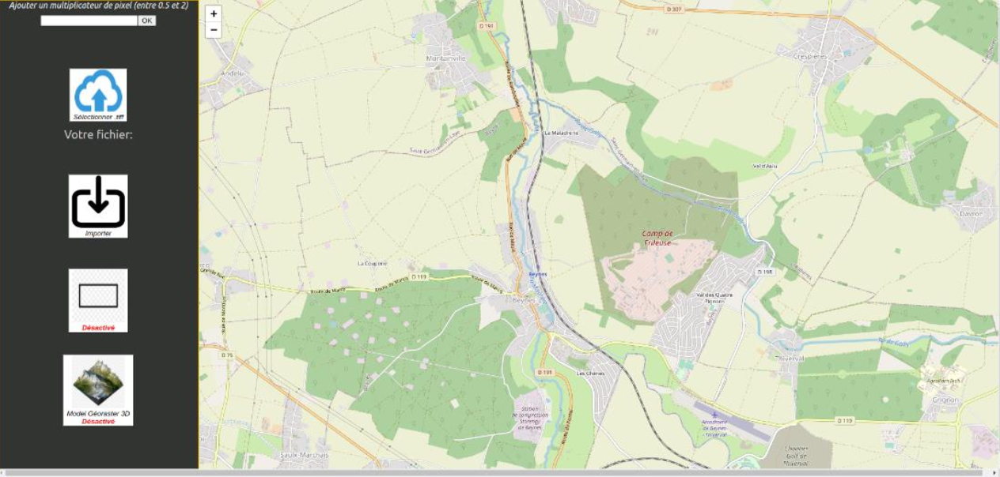
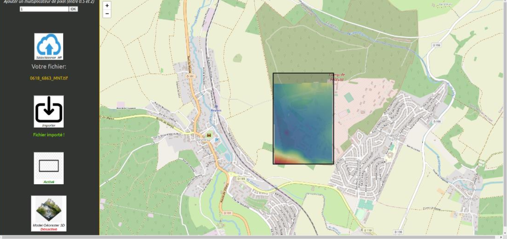

# Methodology deployed :

## Step 1

Development of a web application with the React.js language contained in a Docker
container for a better management of dependencies and their versions. Docker is a tool that
can package an application and its dependencies in an isolated container, which can be run
on any server.

## Step 2

Added the Leaflet map using the javascript library 'react-leaflet' to accurately display the
location of the digital terrain model.

## Step 3: Adding different interactions

- A button to load a '.tiff' or '.tif' file that contains all the data of a digital terrain model
such as its location.
- An input to define the display speed of the digital terrain model which is displayed
according to the movements of the drone.
- A button to create a display rectangle allowing the user to select only a portion of the
digital terrain model to display.

## Step 4

Realization of the 2D display of the digital terrain model, by varying colors according to the
altitude using the javascript library 'chroma-js' (from red for the deepest to blue for the highest).

## Step 5

Use of the Javascript Library 'proj4' to transform geospatial coordinates from one coordinate
reference system (CRS) to another.

## Step 6

Adding the 3D display functionality of the digital terrain model to have a much more
understandable view (using the Javascript Library Three.js). This was a difficult task to
accomplish since I had never done 3D on the web before.

# => Test result : display of a live digital terrain model on a localized 2D background map
and display of the same model in 3D on a web platform.

